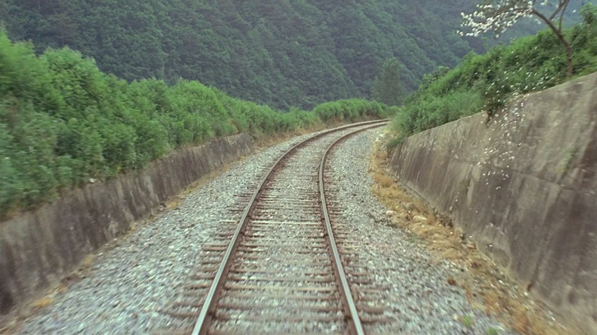
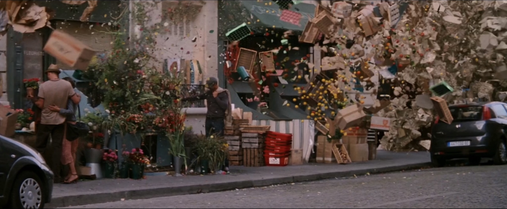
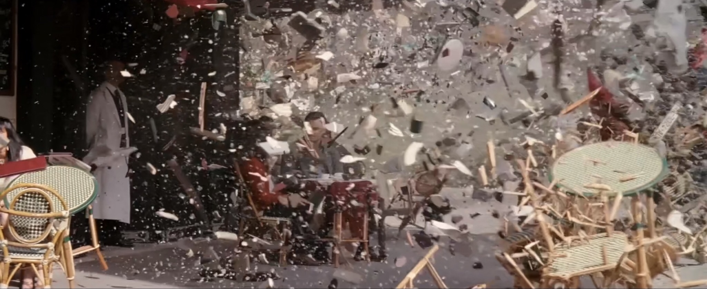
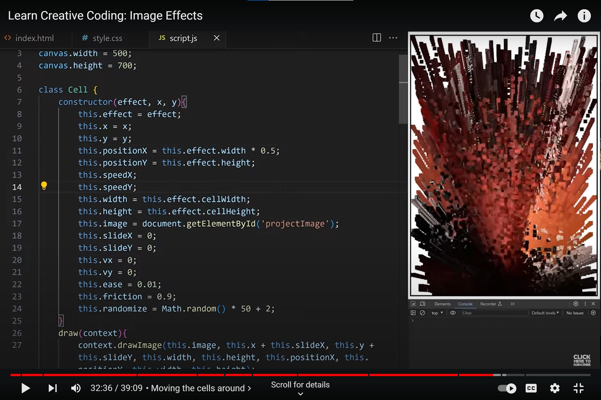

# Quiz 8

##  Imaging Technique Inspiration

The scene in the film *Peppermint Candy* where flowers fall back onto the branches on the train tracks, along with the scene in *Inception* where dreams explode into fragments, showcase a technique of **forming a whole from fragments**. I believe this can be combined with the **splattered paint effects** from the assignment examples to create an **animation effect** where the paint splatters, breaks apart, and then reassembles, potentially even incorporating **a timer** for **periodic fragmentation and recombination**. In works like The Scream this fragmentation further deepens the sense of unease conveyed by the piece itself.

1. *Peppermint Candy*

2. *Inception*

##  Coding Technique Exploration

The project still uses **JavaScript** and **OOP** but explores new methods, such as creating a **Grid** that divides an image into smaller segments. Each segment is an object created using a **constructor**, and it has its own properties, such as **positionX, positionY and speedX, speedY**. The speed of each segment is randomly generated. After setting a start position and an end position, the segments can move, creating an **effect** where the image appears to explode or break apart from different positions. The **render** method is used to visually display the image segments.

[Video Link - Learn Creative Coding: Image Effects](https://www.youtube.com/watch?v=UeZ1pTg_nMo)